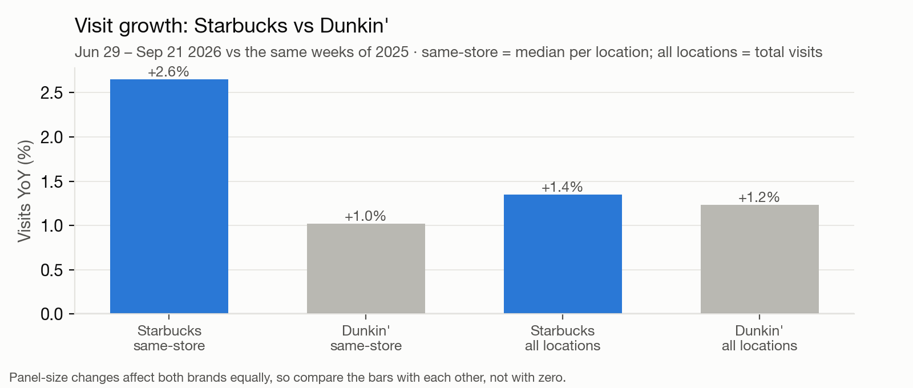
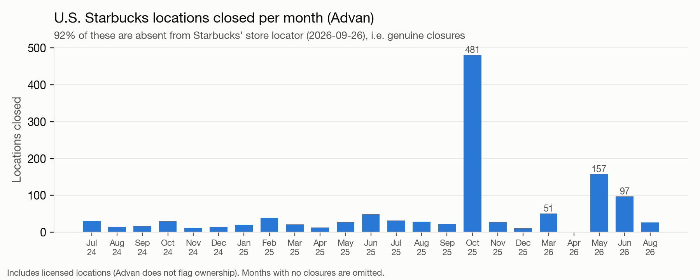
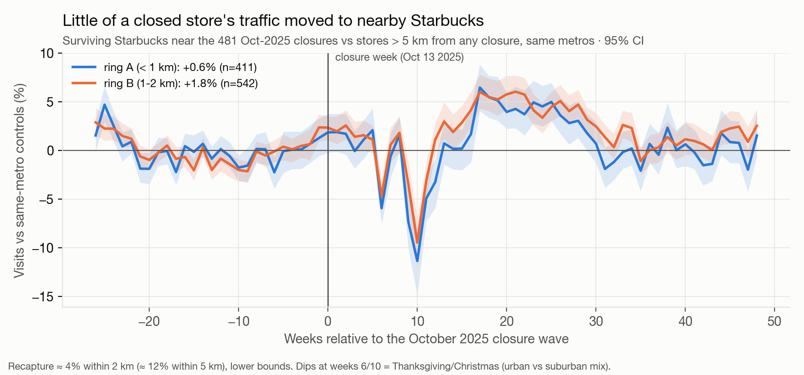
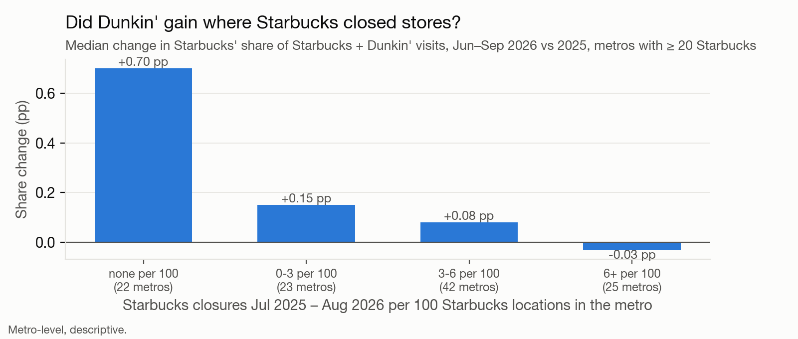
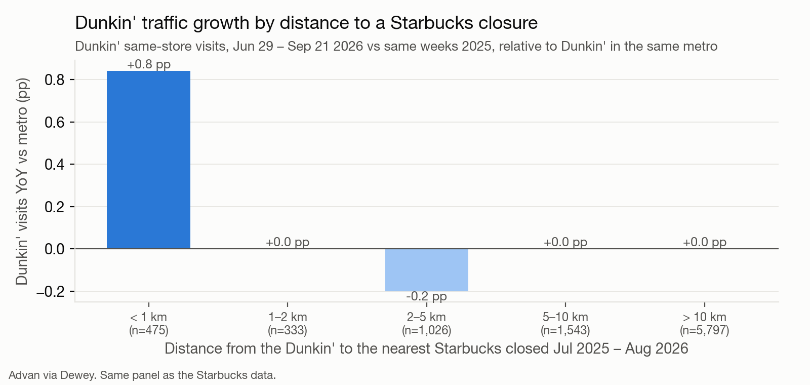
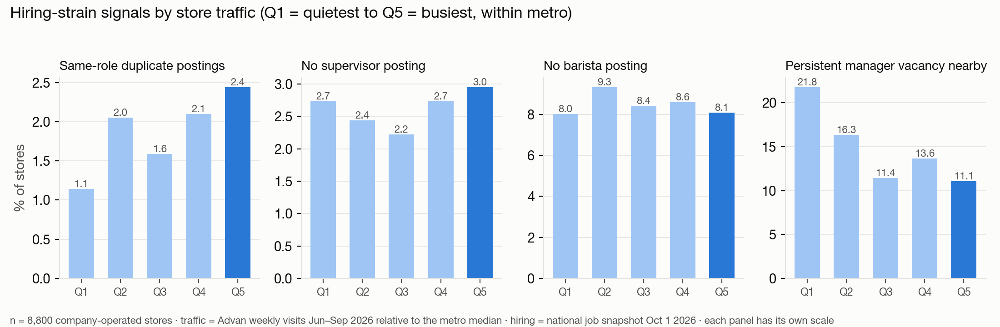

# SBUX: alternative-data summary

*Data as of Oct 1–2, 2026. One page for the team; the full thesis and Q&A prep are in [`PITCH/`](PITCH/README.md).*

## Bottom line

The alternative data **does not show Starbucks' operations deteriorating nationally**. Store traffic is growing and Starbucks is
outgrowing Dunkin' per store. The bearish evidence is **local and forward-looking**: Starbucks is shrinking its store base,
the stores it closes lose most of their customers (some to Dunkin'), and store-manager vacancies cluster around its weaker
stores. This supports a **valuation / expectations** short ("growth now depends on a shrinking store base"), not an
"execution is breaking" short.

## 1. Context: the turnaround is real at the store level

- Same-store visits Jun–Sep 2026 vs 2025: **Starbucks +2.65% vs Dunkin' +1.02%**. Starbucks matched Dunkin's total visit growth
  with **3.3% fewer locations**. Its share of Starbucks + Dunkin' visits is flat YoY (78.1%).
- Consistent with reported Q3 FY26 U.S. comps of +7.9% (transactions +4.2%). **Expect this as the first pushback.**

## 2. Starbucks is shrinking its store base, in waves

- **481 locations closed in Oct 2025**, then a second wave of **~300 in Mar–Jun 2026**. 92% are confirmed absent from Starbucks' own
  store locator. Closures are concentrated in the densest markets (9.2% of locations vs 2.6% in the least dense).

## 3. Closed stores' customers mostly do not stay with Starbucks

- Before/after model of the Oct-2025 wave (953 nearby survivors vs 6,240 same-metro controls): nearby Starbucks recaptured only
  **~4% of the closed stores' visits within 2 km, ~12% within 5 km**. The closed stores were low-traffic (30–45% below
  survivors at the same density).
- **Why it matters:** comparable-store sales exclude closed stores, so this lost traffic never shows up in comps.

## 4. Where Starbucks closed more stores, Dunkin' gained ground

- Across 112 metros, more closures per 100 stores → weaker Starbucks share change vs Dunkin' (Spearman −0.42): **+0.70 pp in
  metros with no closures vs −0.03 pp in metros with 6+ per 100.**

- At the store level, **Dunkin' locations within 1 km of a closed Starbucks grew visits +2.0% vs ~+1.0% elsewhere**
  (+0.8 pp vs Dunkin' in the same metro, 95% CI +0.2 to +1.3); no effect beyond 1 km.
- **But in absolute terms it is small:** nearby Dunkin' absorbed only ~0.8% of the closed stores' visits, and nearby Starbucks ~4%.
  ~95% of the lost traffic is unaccounted for within 2 km (other chains, independents, farther Starbucks, or gone).
  Claim "closures leak demand, partly to competitors", not "Dunkin' is taking Starbucks' customers".

## 5. Store-manager vacancies sit next to the weaker stores

- 195 open store/district-manager requisitions; **42% are re-posted**, 18 open > 90 days (Philadelphia and Chicago suburbs,
  Michigan, Pacific NW, Baltimore/DC).
- Stores in the quietest fifth for their metro are near a persistent manager vacancy **twice as often** as the busiest fifth
  (22% vs 11%; holds after controlling for density). Management says leader stability "is highly correlated to store performance".
- **Not supported:** frontline hiring difficulty. Barista/supervisor hiring is a routine standing pipeline at 99% of stores, and
  requisitions created in 2026 are ~17–20% below 2025.

## What this means for valuation

| Input for the model | What the data says |
|---|---|
| Unit growth | U.S. location base −3.3% YoY (Advan, incl. licensed); closure waves continuing into 2026 |
| Comp sustainability | Store-level traffic healthy (+2.7% same-store visits); closures remove traffic that comps exclude |
| Competitive position | Flat vs Dunkin' nationally; losing ground in closure-heavy metros |
| Margin / labor | Manager instability concentrated near weaker stores; labor investment anniversaries in Q4 FY26 |

## Caveats

- Advan is a phone-panel sample: compare *relative* growth (Starbucks vs Dunkin', near vs far), not raw levels. Closure counts
  include licensed stores.
- Foot-traffic results use one 13-week window (Jun 29 – Sep 21, 2026). **Still to do:** validate Advan against reported
  transactions, stress-test the metro result for metro size, and repeat on rolling quarters.
- The job data is a one-day snapshot (Oct 1, 2026); it cannot measure staffing levels.

## Sources

Starbucks careers API (19,831 U.S. postings) · Advan Weekly Patterns via Dewey (Starbucks + Dunkin', Jan 2024 – Sep 2026) ·
Starbucks store locator via All the Places · Internet Archive · Starbucks Q1–Q3 FY26 calls and 8-K · BLS.
Methods: [`PITCH/3_sources_and_methods.md`](PITCH/3_sources_and_methods.md).

---

**Repo layout:** [`PITCH/`](PITCH/README.md) holds the thesis, Q&A prep, all charts and data. [`_research_archive/`](_research_archive/START_HERE.md)
holds every scraper, raw dataset and full analysis (nothing deleted).
