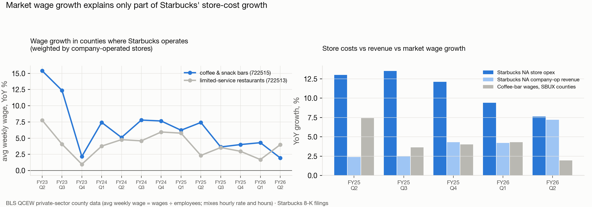
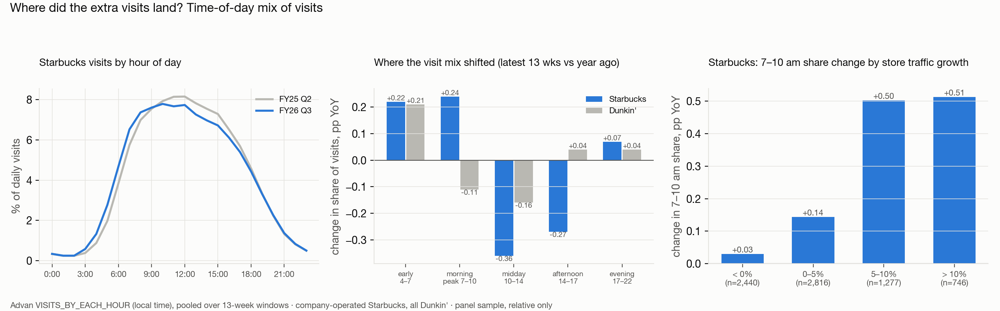
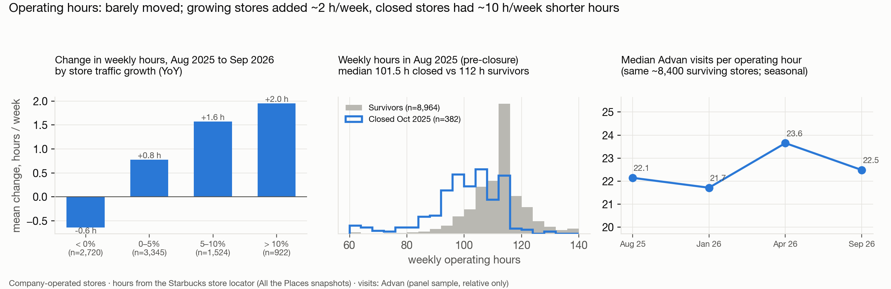
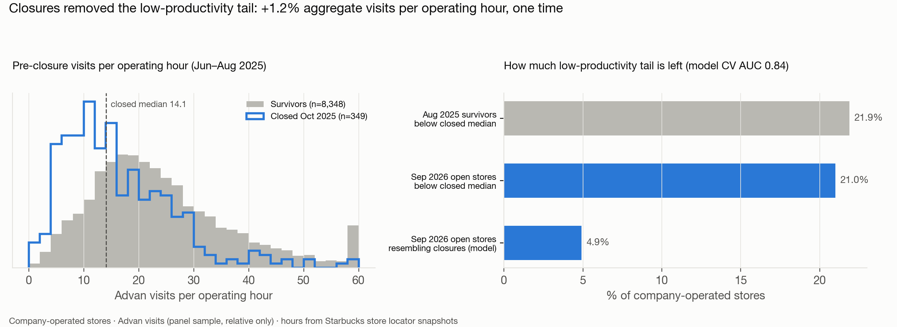

# SBUX: alternative-data summary

*Data as of Oct 2 2026. The full study is in [`pitch_data/`](pitch_data/README.md); earlier work is in [`_research_archive/`](_research_archive/START_HERE.md).*

## Thesis
**Starbucks' sales turnaround is real, but the market may be too optimistic about how quickly sales recovery turns into margin recovery.**
We tested whether the traffic recovery is becoming more labor-efficient or still needs more staff and resources, and tried to
falsify the thesis as well as confirm it.

## Bottom line
**Partly supported, with a clear mechanism.**
- Store costs are still about 5 pp of revenue above FY24.
- The alternative data shows the gap is **not** longer hours, hiring churn or market wage inflation.
- It is a **structural staffing layer**: growth is landing in the morning rush, where extra customers need extra partners on shift.
- Margins recover only if revenue grows into that layer or management cuts it back.
- **The strongest counterpoint:** operating leverage turned positive in FY26 Q3 and is improving fast.

## 1. The cost gap (filings)

- North America store operating expenses were **56.1% of company-operated revenue in FY26 Q3 vs 51.0% in FY24 Q3**.
- Costs outgrew revenue for five straight quarters. FY26 Q3 was the first with leverage (−0.4 pp YoY).
- *Pace (inference):* at Q3's pace, closing 5 pp takes about a decade. Closing it in about 2 years needs costs to grow about 4.5 pp slower than revenue.

## 2. It isn't market wages (BLS QCEW)

- Coffee-bar wages in the counties where Starbucks operates rose **2–4% YoY** (FY25 Q3 – FY26 Q2) and are slowing.
- Starbucks' store costs grew **5–10 pp faster every quarter**, even with fewer stores. **Most of the excess is Starbucks-specific.**
- Easing wage inflation helps margins, but it won't close this gap.

## 3. Growth is landing in the hours that need more staff (Advan hourly)

- **4–10 am holds 30% of visits but produced 52% of the latest YoY visit growth.** Midday and afternoon, the slack hours, lost share.
- The share of visits before 10 am is up **+1.9 pp over two years** (Dunkin' +1.0 pp). Stores are staffed to the rush, so this growth needs more labor per peak hour.

## 4. …while hours and hiring stayed flat

- **Posted hours:** median 112 h/week at every store-locator snapshot (Aug 2025 – Sep 2026). Growing stores added only about 2 h/week.
- **Hiring:** frontline hiring is a fixed standing pipeline (about 2 postings per store per quarter since FY24, from 122k Internet Archive postings).
  It doesn't respond to traffic.
- So the extra labor isn't visible as more hours or more hiring. It shows up as **more partners per shift**: inferred, not directly observed.

## 5. Closures were a small, one-time productivity gain

- The Oct-2025 closures were the low-productivity tail: **14 vs 22 visits per operating hour**, with about 10 fewer hours a week.
- Removing them lifted aggregate productivity by only **+1.2%, once**.
- **21% of open stores** are still below the closed stores' median, and 418 closely resemble them (model AUC 0.84). That's a lever for management:
  good for margins, bad for unit count and traffic. Treat it as two-sided.
- Context from the first pitch: nearby stores recaptured only about 4–12% of closed stores' visits, and closure-hit metros lost share to Dunkin'.

## Evidence against the short (expect these)
- **Leverage is improving fast.** Incremental cost per incremental revenue went 287% → 146% → 122% → 62% → 51% over five quarters.
- **No labor strain.** Store-manager share of postings fell from about 4% (FY25) to 1.7% (FY26).
- **New stores are productive.** 769 new stores run at par with mature ones (about 22 visits per operating hour).
- **Wage inflation is easing**, to about 2% in the latest quarter.
- **Near-term momentum is strong.** Advan tracks reported transactions at r = 0.98 and implies FY26 Q4 U.S. comparable transactions of about +5–6%. **Don't be short into the print.**

## Summary of tests
| Test | Result | For the short? |
|---|---|---|
| Filings: cost ratio | +5 pp vs FY24; first leverage in FY26 Q3 | Supports (pace), trend improving |
| Market wages (BLS) | +2–4%, slowing; costs outgrew them by 5–10 pp | Mixed: rules out wage inflation, supports staffing layer |
| Peak load (Advan hourly) | Growth concentrated 4–10 am | Supports |
| Operating hours | Flat at 112 h | Neutral (rules out hours) |
| Hiring (careers + Internet Archive) | Fixed pipeline; manager churn easing | Weakens a labor-strain story |
| Service (dwell time) | Longer visits at fast-growing stores | Ambiguous |
| Closures | +1.2% one-time gain; tail remains | Supports; two-sided on future closures |
| New stores | At par with mature | Weakens slightly |

## Caveats
- **Staffing per shift is inferred, not measured.** No source here observes labor hours, partners per shift or Starbucks' own wage rates.
- Advan is a phone-panel sample: use relative comparisons only. Its hourly field is noisy, so only time-of-day shares are used.
- BLS QCEW runs through FY26 Q2, so it can't yet test the Q3 inflection.
- **Whether this is a short depends on consensus margin expectations** (the valuation workstream).

## Repo layout
| Folder | Contents |
|---|---|
| [`pitch_data/`](pitch_data/README.md) | **Current study:** 9 workstreams (store panel, hiring pressure, archive hiring, hours, service, closures, new stores, peak load, wages), charts, tables, methods, code |
| [`_research_archive/PITCH_v1/`](_research_archive/PITCH_v1/README.md) | First pitch (valuation / closure-leakage short): thesis, Q&A prep, charts 01–19, the old one-page summary |
| [`_research_archive/`](_research_archive/START_HERE.md) | All scrapers, raw data pipelines and earlier analyses (nothing deleted) |
