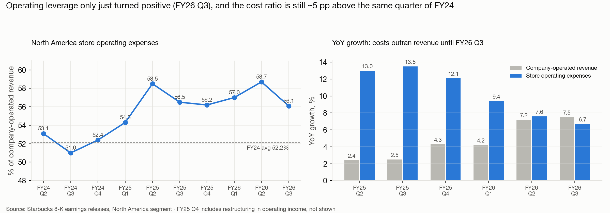

# Labor productivity: is Starbucks' traffic recovery becoming more labor-efficient?

*Data as of Oct 2 2026. Thesis under test: "the sales turnaround is real, but the market may be too optimistic about how quickly
sales recovery converts into margin recovery." We tried to falsify it as well as confirm it.*

## Answer
**Partly supported.**
- **What the store-level data shows:** the traffic recovery is being absorbed **without more posted hours or more hiring**, so visits per
  operating hour are rising slowly.
- **What filings show:** the store cost ratio is still about 5 pp above FY24.
- **Where the extra cost comes from:** not hours or hiring churn, and not mainly market wages.
  - Market wages in Starbucks' counties grew only 2–4% (BLS), while store opex grew 7.6–13.5%.
  - The growth landed in the **morning rush** (52% of visit growth came 4–10 am, a window holding 30% of visits). That is where extra customers need extra partners on shift.
  - So the cost gap is **more labor per peak hour**: a structural layer Starbucks chose, not wage inflation.
- **The case for the short is about pace, not direction.**
  - Operating leverage turned positive only in FY26 Q3: incremental opex was 51% of incremental revenue, below the 56% average.
  - The closure wave delivered a one-time productivity lift of only about +1.2%.
- **Strongest counter-evidence:**
  - Leverage is improving fast: the incremental opex ratio went 287% → 146% → 122% → 62% → 51% over five quarters.
  - Manager posting share fell in FY26.
  - New stores are as productive as the mature base.

| Test | Result | For the short? | Confidence |
|---|---|---|---|
| **Filings: store opex vs revenue** (`tables/`) | Store opex ratio 56.1% in FY26 Q3 vs 51.0% in FY24 Q3. Costs grew faster than revenue for 5 straight quarters; the first leverage came in FY26 Q3 (−0.4 pp YoY) | **Supports** (gap is large, closing slowly), but the trend is improving | High |
| **02 Hiring pressure vs growth** | Frontline postings flat regardless of traffic growth (standing pipeline). Persistent manager vacancies nearby: 8.8% for stores growing > 10% vs 3–4%, and higher near the quietest stores | Neutral; mildly supportive on management | Medium / low–medium |
| **03 Archive hiring (Internet Archive)** | Same uniform pipeline since FY24 (~2 postings per store-quarter); no response to traffic growth. Store-manager share of postings 4% (FY25 H2) → 1.7% (FY26 Q2–Q3) | **Weakens** a labor-strain story | Medium / low–medium |
| **04 Operating hours** | Median 112 h/week at every snapshot. Growing stores added only +2 h/week; same-store visits per operating hour +1.5% (Aug 25 → Sep 26) | Weakens "growth needs more hours"; neutral on margins | High / medium |
| **05 Service quality (Advan dwell)** | Share of visits ≥ 5 min rose more at fast-growing stores (+1.0 vs +0.4 pp). Waiting vs sitting can't be separated | Ambiguous, slightly supportive | Low |
| **06 Closure productivity** | Closed stores ran 14.1 vs 21.7 visits per operating hour with shorter hours (101.5 vs 112 h). Removing them lifts aggregate productivity by only +1.2%, once. 21% of open stores are still below the closed-store median; 418 strongly resemble closures (AUC 0.84) | **Supports** (easy gain was small and is spent); cuts both ways on future closures | Medium–high |
| **08 Peak load (Advan hourly)** | 4–10 am = 30% of visits but 52% of FY26 Q4 growth; share of visits before 10 am +1.9 pp over 2 years (Dunkin' +1.0) | **Supports** (growth lands where labor can't be absorbed) | Medium |
| **09 Market wages (BLS QCEW)** | Coffee-bar wages in Starbucks' counties +2–4% YoY (FY25 Q3 – FY26 Q2), slowing; store opex outgrew them by 5–10 pp every quarter. High-wage counties: 3× the Oct-2025 closure rate | **Mixed:** weakens the wage-inflation version; supports the structural-staffing version | High (data) / medium (decomposition) |
| **07 New stores** | 769 new company-operated stores at 21.7 visits per operating hour, at par with mature stores; ramp to 0.92× metro by 1 year | **Weakens** (mix improves slowly) | Medium |

## What this means for the pitch
1. **Lead with filings and frame alternative data as the explanation.**
   - The store cost ratio is still about 5 pp above FY24.
   - The alternative data shows the gap is **not** from hiring churn or longer hours: those are flat.
   - Market wage rates explain less than half of it: BLS wages grew 2–4%, store opex 7.6–13.5%.
   - Growth is landing in the morning rush, which needs more partners per peak hour.
   - The remainder is **staffing intensity and service investment** (the "Back to Starbucks" / Green Apron service model) plus non-labor costs.
     These are structural, not volume-driven, and easing wage inflation won't fix them.
   - For margins to recover, revenue per store has to outgrow that fixed staffing layer.
2. **Pace math (inference, not data).** In FY26 Q3, opex grew 0.8 pp slower than revenue. The ratio falls by about 0.56 × that gap,
   i.e. about −0.45 pp a year, which matches the observed −0.4 pp. At that pace, closing 5 pp of cost ratio takes about 11 years.
   Doing it in about 2 years needs the cost ratio to fall about 2.5 pp a year, i.e. a growth gap of about 4.5 pp: for example, revenue
   +7% with store opex +2.5%, while the staffing investment holds. The market-implied pace is your teammate's valuation input.
3. **Don't overclaim.**
   - Leverage is clearly improving quarter by quarter.
   - Manager posting share fell.
   - Hours are stable.
   - New stores are productive.

   Expect pushback that "FY26 Q3 is the inflection."
4. **Closures:**
   - The productivity gain from the restructuring was small (+1.2%) and does not repeat.
   - A similar tail still exists: 21% of stores are below the closed-store median, 418 stores are strong look-alikes.
   - That is a lever management can pull (bullish for margins, bearish for unit count and system traffic), so present it as a two-sided risk.

## What this can't see
- Labor hours scheduled per store.
- Partners per shift.
- Starbucks' own wage rates (QCEW is the industry).
- Benefits.
- Rent per store.

The staffing conclusion is inferred: peak-hour growth + flat hours + market wages too slow to explain costs. It is not directly observed. Possible next sources:
- Glassdoor/Indeed reviews mentioning hours cut or understaffing (sentiment over time).
- A paid drive-thru timing study.

## Folders
| Folder | Contents |
|---|---|
| [`01_store_panel/`](01_store_panel/README.md) | Store-level panel: traffic, hours, hiring, density, ownership, closure status |
| [`02_hiring_pressure/`](02_hiring_pressure/README.md) | Hiring Pressure Index (3 specifications), regressions with metro FE, growth cohorts |
| [`03_archive_hiring/`](03_archive_hiring/README.md) | Summary of [`_research_archive/starbucks_hiring_archive/`](../_research_archive/starbucks_hiring_archive/README.md) (Wayback hiring history) |
| [`04_operating_hours/`](04_operating_hours/README.md) | Hours across 5 locator snapshots |
| [`05_service_quality/`](05_service_quality/README.md) | Source assessment + Advan dwell-time test |
| [`06_closure_productivity/`](06_closure_productivity/README.md) | Closed vs survivors, risk model, at-risk store list |
| [`07_new_store_productivity/`](07_new_store_productivity/README.md) | New-store productivity and ramp |
| [`08_peak_load/`](08_peak_load/README.md) | Time-of-day mix of visits: where growth landed |
| [`09_wages/`](09_wages/README.md) | BLS QCEW wages weighted to Starbucks' footprint vs store opex |
| `charts/` | Preview charts (`00`–`09`) |
| `tables/` | Filings: store opex and operating leverage |
| [`methods/`](methods/methods.md) | Run order, sources, definitions, known biases |
| `src/` | All code (`lab.py` holds shared helpers) |

Raw locator snapshots (`data/raw/`) and the 68 MB linked archive table are git-ignored and can be rebuilt from the scripts.
